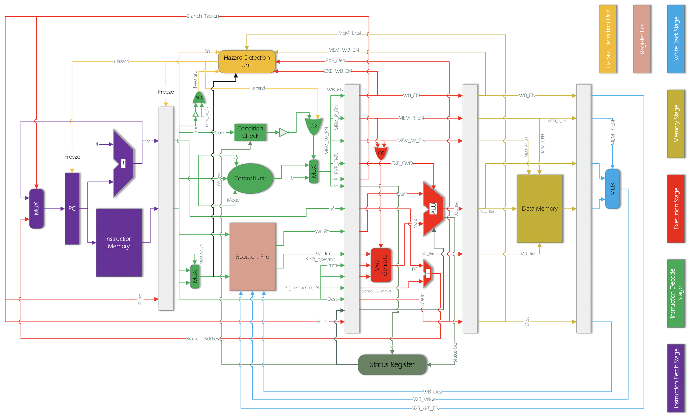

# ARM968E-S_Implementation
This repository contains a custom implementation of an ARM968E-S processor using Verilog. The project is designed to simulate the key features and functionality of a simple ARM processor, with support for basic instruction execution, pipelining, forwarding and SRAM Connection.

## Features
1. **ARM Instruction Set Architecture (ISA):**
   Implements a subset of the ARMv5 instruction set, including data processing,            load/store, and branch instructions.
2. **Pipelined Execution::** Supports a basic 5-stage pipeline (fetch, decode, execute, memory, write-back) to enhance instruction throughput.

3. **Register File:** A fully functional register file including 16 general-purpose registers (R0-R15) and a program counter (PC).

4. **Memory Controller:** Sends and receives data and instruction in connection with SRAM on the FPGA board.

5. **Simulation & Testing:** Provides testbenches to validate the correctness of the ARM instructions and pipeline performance.

## How to Run

1. **Clone the repository:**
   ```bash
   git clone https://github.com/amirhyous/ARM968E-S_Implementation.git
   cd ARM968E-S_Implementation
   ```

2. **Run Simulation:** Compile the codes using Modelsim then simulate the ARM_TB testbench.

For detailed information and instructions, please refer to the [Project Report](ARM968E-S_Implementation.pdf).


